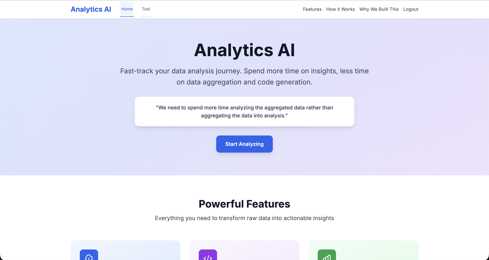

# Analytics AI Platform

## 🚀 Live Demo & Access

Experience the Analytics AI Platform live!

**🌐 Access the Tool:** [https://analytics-ai-frontend-i73iz6e3wq-uc.a.run.app](https://analytics-ai-frontend-i73iz6e3wq-uc.a.run.app)

**🎥 Demo:** [YouTube](https://youtu.be/xPJ12FYTkeA?si=-ke8sMiCSfNZDdTF)



The platform features a modern, clean interface with:
- **Intuitive Navigation**: Easy access to Home and Tool sections
- **Clear Value Proposition**: "Fast-track your data analysis journey"
- **Feature Highlights**: Direct GCS integration, AI code generation, and smart data aggregation
- **User-Friendly Design**: Gradient background and professional layout
- **Call-to-Action**: Prominent "Start Analyzing" button to begin the journey

## 🎯 Objective

The Analytics AI Platform is a powerful, cloud-native application that democratizes data analysis by enabling users to execute Python code on their datasets through an intuitive web interface. Built with modern cloud technologies, it provides a seamless experience for data scientists, analysts, and researchers to perform complex data operations without the need for local development environments.

## 💡 Motivation

### The Problem
- **Technical Barriers**: Traditional data analysis requires complex local setups, multiple dependencies, and environment management
- **Resource Constraints**: Local machines often lack the computational power for large-scale data processing
- **Collaboration Challenges**: Sharing analysis results and code across teams is cumbersome
- **Scalability Issues**: Local environments don't scale with growing data requirements
- **Security Concerns**: Sensitive data analysis requires secure, controlled environments

### The Solution
The Analytics AI Platform addresses these challenges by providing:
- **Zero-Configuration Setup**: No local installations required
- **Cloud-Native Architecture**: Leverages Google Cloud Platform for scalability and reliability
- **Secure Execution Environment**: Isolated, sandboxed code execution
- **Real-Time Collaboration**: Share results and insights instantly
- **AI-Powered Code Generation**: Intelligent code suggestions and error handling

## ✨ Features

### 🚀 Core Functionality
- **Interactive Code Editor**: Full-featured ACE editor with Python syntax highlighting and auto-completion
- **Multi-Format Data Support**: Handles CSV, Excel, Parquet, and other common data formats
- **Real-Time Code Execution**: Execute Python code and see results instantly
- **Dynamic Results Display**: Beautiful, responsive tables for data visualization
- **File Management**: Upload, organize, and manage datasets with ease

### 🔗 Data Integration
- **Google Cloud Storage Integration**: Direct access to GCS buckets
- **Public Dataset Access**: Browse and analyze public datasets
- **Combined Data Sources**: Merge multiple datasets for comprehensive analysis
- **File Upload**: Support for drag-and-drop file uploads
- **Data Preview**: Quick preview of data structure before analysis

### 🤖 AI-Powered Features
- **Intelligent Code Generation**: AI-assisted code creation using Google's Gemini API
- **Smart Error Handling**: Contextual error messages and suggestions
- **Code Optimization**: AI-powered suggestions for better performance
- **Natural Language Queries**: Convert plain English to Python code

### 🔒 Security & Reliability
- **Secure Authentication**: JWT-based user authentication
- **API Key Management**: Secure handling of sensitive credentials via Google Secret Manager
- **Sandboxed Execution**: Isolated code execution environment
- **CORS Protection**: Proper cross-origin resource sharing configuration
- **Input Validation**: Comprehensive input sanitization and validation

### 🌐 Cloud-Native Architecture
- **Auto-Scaling**: Cloud Run automatically scales based on demand
- **Cost Optimization**: Pay-per-use pricing with automatic scaling to zero
- **High Availability**: Built on Google Cloud's robust infrastructure
- **Global Deployment**: Deploy across multiple regions for optimal performance

## 🎭 User Journey

### 👤 For Data Scientists
1. **Access**: Navigate to the platform URL
2. **Authenticate**: Secure login with JWT tokens
3. **Data Import**: Upload datasets or connect to GCS buckets
4. **Code Development**: Use the integrated editor to write Python code
5. **AI Assistance**: Leverage AI for code generation and optimization
6. **Execution**: Run code and view results in real-time
7. **Analysis**: Perform complex data operations and visualizations
8. **Sharing**: Export results or share insights with team members

### 👤 For Business Analysts
1. **Quick Start**: No technical setup required
2. **Data Connection**: Connect to existing data sources
3. **Guided Analysis**: Use AI-generated code templates
4. **Visual Results**: View data in intuitive, formatted tables
5. **Insight Generation**: Focus on analysis rather than technical implementation
6. **Report Creation**: Generate reports from analysis results

### 👤 For Researchers
1. **Data Access**: Connect to research datasets
2. **Reproducible Analysis**: Share code and results for reproducibility
3. **Collaborative Environment**: Work with team members on shared datasets
4. **Advanced Features**: Access to full Python ecosystem for complex analysis
5. **Publication Ready**: Generate publication-quality results and visualizations

## 🏗️ Architecture Overview

### Frontend Architecture
- **Technology Stack**: HTML5, CSS3, JavaScript (ES6+)
- **UI Framework**: Tailwind CSS for responsive design
- **Code Editor**: ACE Editor for syntax highlighting and code editing
- **State Management**: Client-side JavaScript with localStorage/sessionStorage
- **API Integration**: RESTful API communication with backend services

### Backend Architecture
- **Framework**: FastAPI (Python 3.11+)
- **Database**: SQLite for lightweight, file-based data storage
- **Authentication**: JWT tokens with secure session management
- **API Design**: RESTful endpoints with OpenAPI documentation
- **Error Handling**: Comprehensive error handling and logging

### Cloud Infrastructure
- **Container Platform**: Google Cloud Run for serverless deployment
- **Container Registry**: Google Container Registry (GCR) for Docker images
- **Storage**: Google Cloud Storage for file management
- **Secrets Management**: Google Secret Manager for API keys and credentials
- **Networking**: Cloud Load Balancing and CDN for optimal performance

### Security Architecture
- **Authentication**: JWT-based authentication with secure token management
- **Authorization**: Role-based access control (RBAC)
- **Data Encryption**: End-to-end encryption for sensitive data
- **Network Security**: VPC and firewall rules for network isolation
- **Audit Logging**: Comprehensive logging for security monitoring

## 📁 Project Structure

```
analytics-ai/
├── README.md                           # This comprehensive documentation
├── docker/                             # Docker configuration files
│   ├── Dockerfile.backend             # Backend container definition
│   └── Dockerfile.frontend            # Frontend container definition
├── config/                            # Configuration files
│   ├── requirements.txt               # Python dependencies
│   └── .env.example                   # Environment variables template
├── backend/                           # Backend application code
│   ├── main.py                        # FastAPI application entry point
│   ├── models/                        # Data models and schemas
│   │   ├── user.py                    # User model definitions
│   │   └── session.py                 # Session management
│   ├── routes/                        # API route handlers
│   │   ├── auth.py                    # Authentication endpoints
│   │   ├── code_generation.py         # Code execution endpoints
│   │   └── data.py                    # Data management endpoints
│   └── database/                      # Database configuration
│       └── database.py                # Database connection and setup
├── frontend/                          # Frontend application
│   └── index.html                     # Single-page application
├── data/                              # Local data storage
│   └── analytics_ai.db                # SQLite database file
├── scripts/                           # Utility scripts
│   ├── start.sh                       # Local development startup
│   ├── stop.sh                        # Local development shutdown
│   └── logs.sh                        # View application logs
├── deployment/                        # Deployment configurations
│   ├── cloud-run/                     # Cloud Run service definitions
│   │   ├── backend-service.yaml       # Backend service configuration
│   │   └── frontend-service.yaml      # Frontend service configuration
│   ├── secrets/                       # Secret management
│   │   └── secrets.yaml               # Secret definitions
│   └── scripts/                       # Deployment scripts
│       ├── deploy.sh                  # Main deployment script
│       ├── create-secrets.sh          # Secret creation script
│       └── setup.sh                   # Interactive setup script
└── docker-compose.yml                 # Local development orchestration
```

## 🚀 Quick Start Guide

### Prerequisites
- **Google Cloud Platform Account**: Active GCP account with billing enabled
- **Google Cloud SDK**: Installed and configured (`gcloud` CLI)
- **Docker**: For local development and container builds
- **Git**: For version control and deployment

### Local Development Setup

#### 1. Clone the Repository
```bash
git clone https://github.com/your-username/analytics-ai.git
cd analytics-ai
```

#### 2. Environment Configuration
```bash
# Copy the environment template
cp config/.env.example config/.env

# Edit the environment file with your values
nano config/.env
```

**Required Environment Variables:**
```bash
# API Keys
GEMINI_API_KEY=your_gemini_api_key_here
JWT_SECRET=your_secure_jwt_secret_here

# Application Configuration
DATABASE_PATH=data/analytics_ai.db
PYTHONPATH=/app
```

#### 3. Start Local Development
```bash
# Start all services
./scripts/start.sh

# View logs
./scripts/logs.sh

# Stop services
./scripts/stop.sh
```

#### 4. Access the Application
- **Frontend**: http://localhost:3000
- **Backend API**: http://localhost:8000
- **API Documentation**: http://localhost:8000/api/docs

### Production Deployment

#### 1. Interactive Setup (Recommended)
```bash
# Run the interactive setup script
./deployment/scripts/setup.sh
```

The setup script provides a menu-driven interface:
```
🚀 Analytics AI Platform Setup
====================================
1. Complete Setup (Infrastructure + Deploy)
2. Infrastructure Only
3. Deploy Only
4. Local Test
5. Cleanup
6. Show URLs
7. Exit

Choose an option [1-7]:
```

#### 2. Manual Deployment
```bash
# Set your GCP project ID
export PROJECT_ID=your-project-id
export GEMINI_API_KEY=your-gemini-api-key
export JWT_SECRET=your-jwt-secret

# Run deployment
./deployment/scripts/deploy.sh
```

## 🔧 Detailed Setup Instructions

### Environment Variables

#### Local Development (.env file)
```bash
# Database Configuration
DATABASE_PATH=data/analytics_ai.db
PYTHONPATH=/app

# Security
JWT_SECRET=local_development_jwt_secret_key_change_in_production
GEMINI_API_KEY=your_gemini_api_key_here

# Application Settings
NODE_ENV=development
DEBUG=true
```

#### Production (Google Secret Manager)
- `gemini-api-key`: Google Gemini API key for AI code generation
- `jwt-secret`: Secret key for JWT token signing and verification

### Docker Configuration

#### Backend Dockerfile Features
- **Multi-stage Build**: Optimized for production with minimal image size
- **Security**: Non-root user execution for enhanced security
- **Health Checks**: Built-in health monitoring
- **Dependency Caching**: Efficient layer caching for faster builds

#### Frontend Dockerfile Features
- **Nginx**: High-performance web server
- **Static File Serving**: Optimized for single-page applications
- **Health Monitoring**: Container health checks
- **Security Headers**: Proper security configuration

### Database Schema

#### Users Table
```sql
CREATE TABLE users (
    id INTEGER PRIMARY KEY AUTOINCREMENT,
    username TEXT UNIQUE NOT NULL,
    email TEXT UNIQUE NOT NULL,
    hashed_password TEXT NOT NULL,
    created_at TIMESTAMP DEFAULT CURRENT_TIMESTAMP,
    is_active BOOLEAN DEFAULT TRUE
);
```

#### Sessions Table
```sql
CREATE TABLE sessions (
    id TEXT PRIMARY KEY,
    user_id INTEGER NOT NULL,
    created_at TIMESTAMP DEFAULT CURRENT_TIMESTAMP,
    expires_at TIMESTAMP NOT NULL,
    FOREIGN KEY (user_id) REFERENCES users (id)
);
```

## 🔌 API Documentation

### Authentication Endpoints

#### POST /api/auth/register
Register a new user account.
```json
{
    "username": "string",
    "email": "string",
    "password": "string"
}
```

#### POST /api/auth/login
Authenticate user and receive JWT token.
```json
{
    "username": "string",
    "password": "string"
}
```

#### POST /api/auth/logout
Invalidate current session.
```json
{
    "token": "string"
}
```

### Data Management Endpoints

#### GET /api/data/buckets
List available GCS buckets.

#### GET /api/data/bucket/{bucket_name}/files
List files in a specific bucket.
```json
{
    "files": [
        {
            "name": "string",
            "size": "number",
            "created": "timestamp",
            "bucket": "string"
        }
    ]
}
```

#### GET /api/data/combined-files?public_bucket={bucket_name}
Get combined files from default and public buckets.

#### POST /api/data/upload
Upload files to the default bucket.

#### DELETE /api/data/delete/{file_name}
Delete a specific file.

### Code Execution Endpoints

#### POST /api/code/generate
Generate Python code using AI.
```json
{
    "prompt": "string",
    "selected_files": ["string"],
    "language": "python"
}
```

#### POST /api/code/execute
Execute Python code and return results.
```json
{
    "code": "string",
    "language": "python",
    "selected_files": ["string"]
}
```

**Response:**
```json
{
    "success": true,
    "table_html": "string",
    "error": null
}
```

## 🛠️ Development Workflow

### Local Development
1. **Make Changes**: Edit code in your preferred editor
2. **Test Locally**: Use `./scripts/start.sh` to test changes
3. **View Logs**: Monitor with `./scripts/logs.sh`
4. **Commit Changes**: Use git to version control your changes

### Deployment Workflow
1. **Test Locally**: Ensure all tests pass locally
2. **Commit Changes**: Push changes to your repository
3. **Deploy**: Run `./deployment/scripts/setup.sh` option 3
4. **Verify**: Test the deployed application
5. **Monitor**: Check logs and performance metrics

### Code Quality
- **Linting**: Python code follows PEP 8 standards
- **Type Hints**: Comprehensive type annotations
- **Documentation**: Inline documentation for all functions
- **Error Handling**: Robust error handling throughout

## 🔒 Security Considerations

### Authentication & Authorization
- **JWT Tokens**: Secure, stateless authentication
- **Password Hashing**: bcrypt for secure password storage
- **Session Management**: Automatic token expiration
- **CORS Configuration**: Proper cross-origin resource sharing

### Data Protection
- **Input Validation**: Comprehensive input sanitization
- **SQL Injection Prevention**: Parameterized queries
- **XSS Protection**: Output encoding and CSP headers
- **CSRF Protection**: Token-based request validation

### Infrastructure Security
- **Container Security**: Non-root user execution
- **Network Security**: VPC and firewall rules
- **Secret Management**: Google Secret Manager integration
- **Audit Logging**: Comprehensive security event logging

## 📊 Performance Optimization

### Frontend Optimization
- **Code Splitting**: Modular JavaScript loading
- **Asset Compression**: Minified CSS and JavaScript
- **Caching Strategy**: Browser caching for static assets
- **CDN Integration**: Global content delivery

### Backend Optimization
- **Database Indexing**: Optimized query performance
- **Connection Pooling**: Efficient database connections
- **Response Caching**: Intelligent response caching
- **Async Processing**: Non-blocking I/O operations

### Cloud Optimization
- **Auto-Scaling**: Automatic resource scaling
- **Cost Optimization**: Pay-per-use pricing model
- **Load Balancing**: Distributed traffic handling
- **Monitoring**: Comprehensive performance monitoring

## 🐛 Troubleshooting

### Common Issues

#### Local Development Issues
```bash
# Port conflicts
Error: Port 8000 is already in use
Solution: Stop other services or change ports in docker-compose.yml

# Environment variables
Error: .env file not found
Solution: Copy config/.env.example to config/.env and configure

# Docker issues
Error: Container failed to start
Solution: Check logs with ./scripts/logs.sh
```

#### Deployment Issues
```bash
# Authentication errors
Error: gcloud authentication failed
Solution: Run gcloud auth login

# Permission errors
Error: Insufficient permissions
Solution: Check IAM roles and permissions

# Build failures
Error: Docker build failed
Solution: Check Dockerfile syntax and dependencies
```

### Debugging Steps
1. **Check Logs**: Always start with log analysis
2. **Verify Configuration**: Ensure all environment variables are set
3. **Test Connectivity**: Verify network connectivity and firewall rules
4. **Resource Limits**: Check for resource constraints
5. **Dependency Issues**: Verify all dependencies are properly installed

### Getting Help
- **Documentation**: Check this README for detailed instructions
- **API Docs**: Visit `/api/docs` for interactive API documentation
- **Logs**: Use `./scripts/logs.sh` for detailed error information
- **Community**: Check GitHub issues for similar problems

## 🔄 Maintenance & Updates

### Regular Maintenance Tasks
- **Security Updates**: Keep dependencies updated
- **Performance Monitoring**: Monitor application performance
- **Backup Strategy**: Regular database and configuration backups
- **Log Rotation**: Manage log file sizes and retention

### Update Procedures
1. **Test Updates**: Always test updates in development first
2. **Backup Data**: Create backups before major updates
3. **Staged Deployment**: Use blue-green deployment for zero downtime
4. **Rollback Plan**: Have a rollback strategy ready

### Monitoring & Alerting
- **Health Checks**: Automated health monitoring
- **Performance Metrics**: CPU, memory, and response time monitoring
- **Error Tracking**: Comprehensive error logging and alerting
- **User Analytics**: Usage patterns and performance insights

## 🤝 Contributing

### Development Guidelines
1. **Fork the Repository**: Create your own fork
2. **Create Feature Branch**: Use descriptive branch names
3. **Follow Code Style**: Adhere to existing code conventions
4. **Write Tests**: Include tests for new features
5. **Document Changes**: Update documentation as needed
6. **Submit Pull Request**: Provide clear description of changes

### Code Style
- **Python**: Follow PEP 8 guidelines
- **JavaScript**: Use ES6+ features and consistent formatting
- **CSS**: Follow Tailwind CSS conventions
- **Documentation**: Comprehensive inline and external documentation

## 📄 License

This project is licensed under the MIT License - see the [LICENSE](LICENSE) file for details.

## 🙏 Acknowledgments

- **Google Cloud Platform**: For providing robust cloud infrastructure
- **FastAPI**: For the excellent Python web framework
- **Tailwind CSS**: For the utility-first CSS framework
- **ACE Editor**: For the powerful code editor
- **Open Source Community**: For the various libraries and tools used

## 📞 Support

For support, questions, or contributions:
- **GitHub Issues**: Report bugs and request features
- **Documentation**: Check this README for detailed information
- **API Documentation**: Visit `/api/docs` for interactive API reference
- **Community**: Join our community discussions

---
